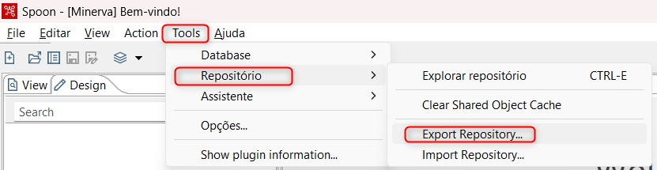

# Projeto Python para gestão de artefatos do pentaho

O objetivo do projeto é ler o arquivo XML exportado do pentaho e inserir os dados em uma tabela no banco de dados.

_Obs.: A versão do Python utilizada no projeto é a '3.12.2'._

---
# Exportação Arquivo XML
Exportar o repositório em formato de arquivo .xml:
---


---
# 📂 Estrutura de Pasta

A estrutura de pastas foi organizada seguindo princípios de orientação a objetos, conforme preferência do autor.

* **assets/**: Pasta onde se encontram os arquivos estáticos XML e Excel.
* **controller/**: Pasta onde se encontram todas as funções criadas, referentes à transformação de dados, operações de banco de dados e automatizações.
* **model/**: Pasta onde se encontram as classes de banco de dados criadas, referentes às tabelas do banco.
* **service/**: Pasta onde se encontram as funções criadas para conexão ao banco de dados.

---
# 💾 Banco de dados e ORM
A tecnologia de banco de dados utilizada foi o SQL Server, e o ORM utilizado foi o sqlalchemy.

---
# Instalação

1. 📥 Clone o repositório:
    ```sh
    git clone https://github.com/edvaldo-gutierres/artefatos_pentaho
    ```
2. 📦 Instale as dependências:
    ```sh
    pip install -r requirements.txt
    ```
3. 🛠️ Configure as variáveis de ambiente criando um arquivo `.env` na raiz do projeto:
    ```
    SERVER=<endereco-do-servidor>
    DATABASE=<nome-do-banco-de-dados>
    USER=<seu-usuario>
    PASSWORD=<sua-senha>
    ```
4. ▶️ Execute o projeto:
    ```sh
    python app.py
    ```
---